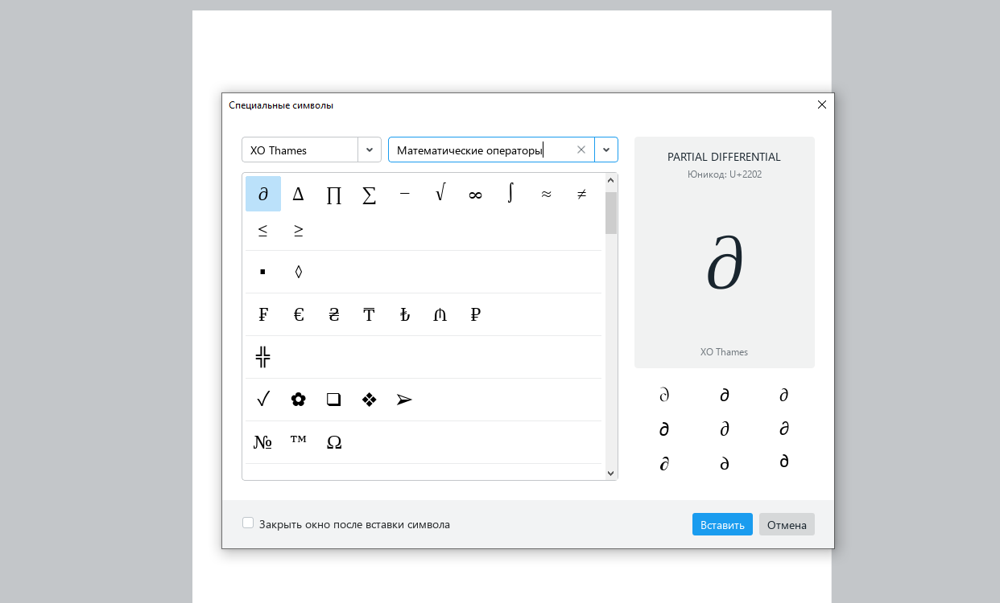
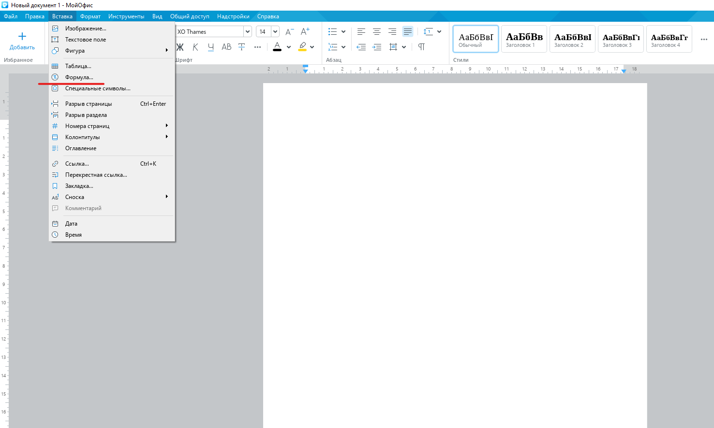
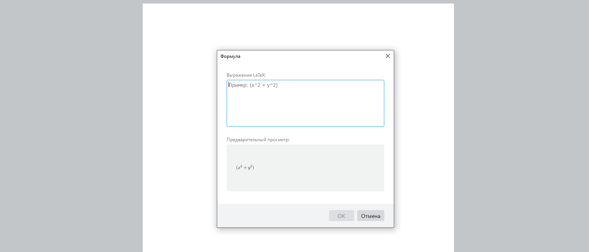
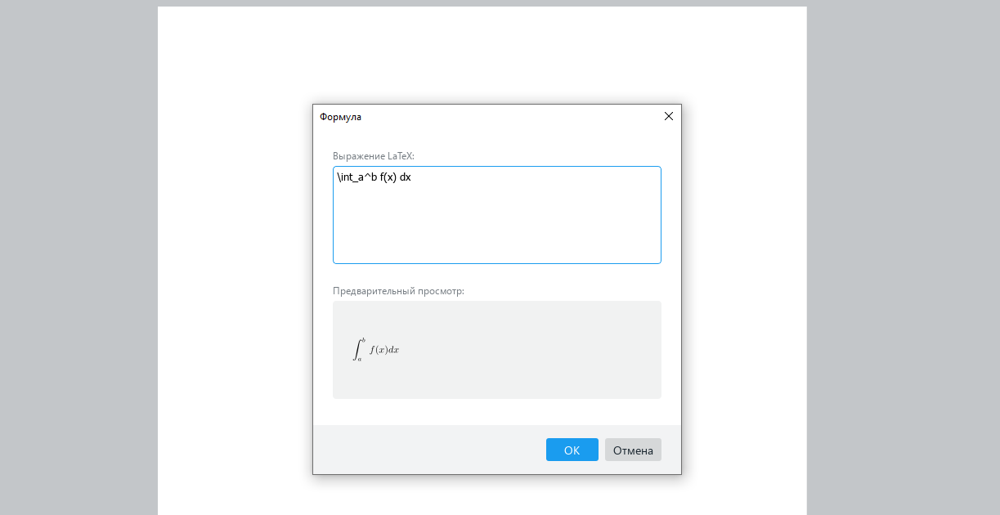

Здравствуйте, уважаемые читатели! 👋



Любой текст состоит из букв, знаков препинания и иногда цифр. Все эти символы легко вводятся с клавиатуры. Но порой в документ нужно вставить особые знаки, например ноты или химические формулы. При этом от точности их отображения во многом зависит смысл: если фа «сползет» чуть ниже, музыкант сыграет другой звук. Что уж говорить о знаке степени, который в формуле никак нельзя путать с простым умножением?

Чтобы избежать неточностей и привести подобные записи к единому стандарту, была разработана система компьютерной верстки LaTeX. Благодаря ей вы можете сосредоточиться на содержимом документа — вместо ручного распределения текста или формулы по странице, как в других текстовых редакторах, можно просто вводить их, позволив LaTeX заняться остальным.

Система была была разработана американским профессором информатики Дональдом Кнутом, автором «библии программистов» The Art of Computer Programming. Она основана на парадигме редактирования WYSIWYM (What You See Is What You Mean — что вижу, то и подразумеваю).

LaTeX необходим студентам, аспирантам, преподавателям, ученым и любым другим специалистам, для которых важна корректность отображения любых данных. Сегодня эта система включает множество пакетов-дополнений для работы с данными различных форматов: формулами, графиками, сносками, нотами и прочими.

Одна из особенностей LaTeX — то, что можно создать формулу и не бояться, что при изменении шрифта она изменит вид.

## Основные моменты работы с LaTeX

Работа с LaTeX сводится к написанию кода, в котором есть ряд базовых компонентов и фрагментов. При этом, надо знать несколько нюансов:

- Внутритекстовые формулы обособляются с обеих сторон знаками $.
- Выключнные формулы (вынесенные в отдельную строку) обособляются знаками $ или парой команд `\[` и `\]`. Формулы, заключенные в $ всегда центрируются по горизонтали.
- Внутритекстовые формулы, за исключением самых коротких, набираются отдельной строкой.
- Для выравнивания документа служат теги: \flushleft — по левому краю, \flushrigth — по правому краю, \center — по центру.
- Окружение verbatim по умолчанию помогает корректно отображать даже сложный программный код.
- Большинство математических функций и символов, а также скобки, матрицы и системы уравнений в синтаксисе LaTeX обозначаются тегами, начинающимися с символа `\.`
- Для работы с выражениями, которые занимают больше одной строки (то есть для аккуратного переноса текста или вычислений), можно использовать разделитель `\\.`
- Буквы греческого языка и лемниската, символ бесконечности и другие вводятся в виде тегов.
После изучении основ и базовых тегов языка, ввод и последующее редактирование формул становится простым и понятным процессом. В изучении несложного синтаксиса LaTeX поможет учебник Сергея Львовского.

## Как пользоваться LaTeX в редакторе «МойОфис Текст»

В МойОфис LaTeX применяется для ввода формул и математических выражений. Для основных математических формул, знаков валют и других специальных символов в редакторе «МойОфис Текст» вы можете воспользоваться меню «Специальные символы».

Но если вам нужно ввести сложную математическую формулу, то лучше воспользоваться специальным меню «Формула».

Чтобы вставить формулу, зайдите в меню «Вставка» на панели инструментов и выберите пункт «Формула».

После подтверждения появится всплывающее окно с полями «Выражение LaTeX» и «Предварительный просмотр».

Для примера, введем простую формулу определенного интеграла функции f(x) на интервале [a, b]. Она будет выглядеть так:

\int_a^b f(x) dx

В поле «Предварительный просмотр» можно сразу увидеть, как будет выглядеть итоговая формула. Это удобно — вносить правки можно сразу по месту, а не после вставки формулы в документ

После вставки формулы, ее, как и любой другой объект в редакторе «МойОфис Текст» можно перемещать, выравнивать и даже изменять размер.

Если формулу нужно отредактировать, достаточно дважды кликнуть по ней левой кнопкой мыши — откроется всплывающее окно с полями правок и предварительного просмотра.

Удалить формулу можно клавишами [Backspace], [Del] или специальной кнопкой на панели инструментов.

